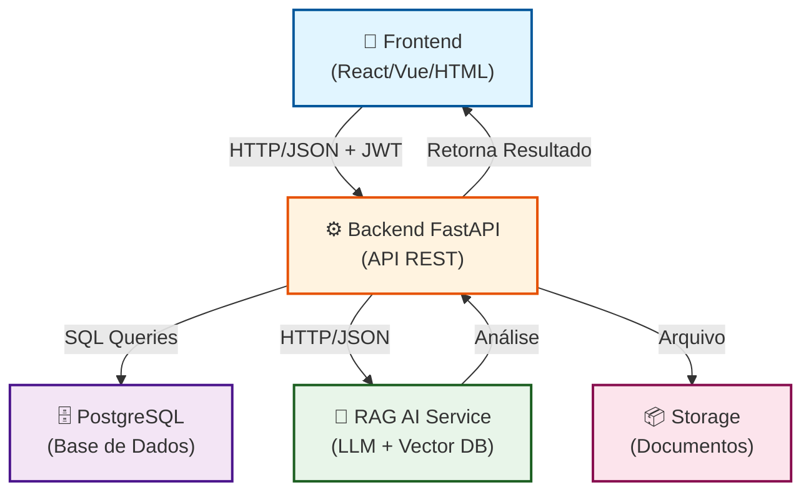

 # ClarIA Backend

[](https://fastapi.tiangolo.com/)
[](https://www.python.org/)
[](https://www.postgresql.org/)
[](https://www.docker.com/)

API robusta em **FastAPI** com PostgreSQL para processamento inteligente de documentos administrativos utilizando técnicas de RAG (Retrieval-Augmented Generation).

---

## 📋 Índice

1. [Visão Geral](#visão-geral)
2. [Problema (Dor)](#problema-dor)
3. [Solução Proposta](#solucao-proposta)
4. [Tecnologias e Justificativa](#tecnologias-e-justificativa)
5. [Arquitetura](#arquitetura)
6. [Fluxo de Comunicação](#fluxo-de-comunicação)
7. [Endpoints](#endpoints)
8. [Como Rodar Localmente](#como-rodar-localmente)
9. [Equipe](#equipe)
10. [Frontend](#frontend)
11. [RAG (Retrieval-Augmented Generation)](#rag-retrieval-augmented-generation)
12. [Recursos Adicionais](#recursos-adicionais)
13. [Licença](#licenca)

---

<a id="visao-geral"></a>

## 🎯 Visão Geral

ClarIA é uma plataforma inteligente que auxilia servidores administravios do SEI na análise e despacho de processos administrativos. O backend fornece APIs RESTful para:

- **Autenticação e gerenciamento de usuários** com papéis (Professor, Avaliador)
- **Criação e gerenciamento de processos** administrativos
- **Upload e processamento paralelo de documentos** em múltiplos formatos
- **Análise inteligente com IA** (RAG) para geração automática de resumos e despachos
- **Validação e aprovação de despachos** por avaliadores

---

<a id="problema-dor"></a>

## ⚙️ Problema (Dor)

### Contexto Institucional

A transformação digital consolidou-se como um dos principais desafios das instituições públicas brasileiras, especialmente nas universidades que lidam diariamente com elevado volume de processos administrativos, acadêmicos e financeiros. Na **Universidade Estadual do Piauí (UESPI)**, a tramitação de documentos, análise de solicitações e acompanhamento processual ainda envolvem **atividades repetitivas e validações manuais**, impactando diretamente a eficiência administrativa e a experiência dos usuários.

A estrutura **multicampi** da universidade amplifica a complexidade operacional, exigindo maior capacidade de gestão e aumentando a ocorrência de:
- ⏱️ **Retrabalho e inconsistências** nos fluxos administrativos
- 📋 **Processos percorrendo diversos setores** até sua conclusão
- 🔴 **Atrasos, acúmulo de demandas** e dificuldades no monitoramento processual
- 📌 **Falta de rastreabilidade** e transparência nas decisões

### Desafios Técnicos

1. **Processamento de Múltiplos Documentos em Paralelo**
   - Necessidade de upload confiável e rápido de múltiplos arquivos
   - Validação de tipos (PDF, DOC, DOCX) e limites de tamanho
   - Processamento concorrente sem bloquear a aplicação

2. **Integração Frontend ↔ Backend**
   - Formulários HTML enviam dados em `application/x-www-form-urlencoded` por padrão
   - Necessidade de suportar tanto JSON quanto dados de formulário nos endpoints
   - Facilitar testes manuais rápidos com frontend leve (HTMX)

3. **Testabilidade em Arquitetura Assíncrona**
   - SQLAlchemy async e dependências assíncronas aumentam complexidade de testes
   - Isolamento de banco de dados e clientes externos (RAG) é crítico
   - Necessidade de mocks e fixtures específicos para cada componente

4. **Análise Inteligente de Documentos**
   - Extração automática de informações-chave dos documentos
   - Geração de resumos e despachos coerentes e contextualizados
   - Validação de normas e regulamentações específicas da instituição

---

<a id="solucao-proposta"></a>

## 💡 Solução Proposta

### Inteligência Artificial como Estratégia de Modernização

Diante desse cenário desafiador, a **Inteligência Artificial surge como oportunidade estratégica** para modernização da gestão pública universitária. A solução ClarIA foi desenvolvida para:

✅ **Automatizar tarefas repetitivas** — Eliminar atividades manuais e validações demoradas  
✅ **Identificar inconsistências documentais** — Validação automática e inteligente de arquivos  
✅ **Classificar e organizar processos** — Direcionamento automático para setores apropriados  
✅ **Apoiar a tomada de decisão** — Sugestões inteligentes baseadas em análise de dados  
✅ **Aumentar eficiência e produtividade** — Reduzir tempo de tramitação e atrasos  
✅ **Promover transparência institucional** — Rastreabilidade completa de processos  

### Abordagem Implementada

A solução é baseada em **Retrieval-Augmented Generation (RAG)** com aprimoramento supervisionado contínuo, permitindo:

- **API REST estruturada** com validação rigorosa de entrada/saída
- **Processamento assíncrono** com `asyncio.gather()` para paralelizar uploads
- **Suporte flexível** a múltiplos formatos de dados (JSON e form-encoded)
- **RAG Client** integrado para análise inteligente de documentos
- **Testes abrangentes** com mocks para componentes externos
- **Documentação automática** via Swagger/OpenAPI em `/docs`
- **Evolução controlada** dos fluxos e bases normativas sem treinamento autônomo sobre dados sensíveis

### Potencial de Escalabilidade

A proposta possui **potencial de escalabilidade para outros órgãos públicos** municipais, estaduais e federais que utilizam sistemas eletrônicos de tramitação processual. Ao integrar tecnologia, inovação e gestão pública, o projeto contribui para fortalecimento da transformação digital no estado do Piauí e para o desenvolvimento de soluções alinhadas às necessidades contemporâneas da administração pública.

<a id="tecnologias-e-justificativa"></a>

---

## 🛠️ Tecnologias e Justificativa

| Tecnologia | Versão | Justificativa |
|---|---|---|
| **FastAPI** | 0.104+ | Alta produtividade, validação automática com Pydantic, documentação automática (`/docs`), excelente suporte a async/await para operações IO-bound |
| **Python** | 3.11+ | Tipagem moderna com type hints, asyncio nativo, ecossistema maduro para web e IA |
| **PostgreSQL** | 15+ | Banco de dados relacional robusto e escalável, ACID compliance, suporte a JSON e arrays nativos |
| **SQLAlchemy** | 2.0+ | ORM assíncrono com controle fino, migrations via Alembic, validação de modelos, lazy loading configurável |
| **Alembic** | 1.12+ | Versionamento de schema e migrations, histórico completo de alterações, rollback seguro |
| **Pydantic** | 2.0+ | Validação de dados com type hints, serialização JSON automática, modelos reutilizáveis |
| **Docker & Docker Compose** | Latest | Ambiente reprodutível (API + Postgres), facilita CI/CD, desenvolvimento local idêntico à produção |
| **Uvicorn** | 0.24+ | Servidor ASGI high-performance para executar FastAPI |

<a id="arquitetura"></a>

---

## 🏗️ Arquitetura

### Estrutura de Diretórios

```
ClarIA_backend/
├──tarefas e épicos do MVP
├── 📁 src/
│   ├── 📁 app/
│   │   ├── 📁 api/routes/
│   │   │   ├── 📝 README.md              # Documentação das rotas
│   │   │   ├── 🐍 __init__.py
│   │   │   ├── 🐍 analise.py             # Rotas de análise inteligente
│   │   │   ├── 🐍 auth.py                # Rotas de autenticação e registro
│   │   │   ├── 🐍 dispatch.py            # Rotas de despacho e preview
│   │   │   └── 🐍 processos.py           # Rotas de CRUD de processos
│   │   │
│   │   ├── 📁 core/
│   │   │   ├── 📝 README.md              # Documentação do núcleo
│   │   │   ├── 🐍 __init__.py
│   │   │   ├── 🐍 config.py              # Configuração e variáveis de ambiente
│   │   │   ├── 🐍 connection.py          # Pool de conexões com DB
│   │   │   ├── 🐍 database.py            # Inicialização e gerenciamento de DB
│   │   │   ├── 🐍 dependencies.py        # Dependências compartilhadas (JWT, DB)
│   │   │   └── 🐍 security.py            # JWT, hash de senha, autenticação
│   │   │
│   │   ├── 📁 models/
│   │   │   ├── 📝 README.md              # Documentação dos modelos
│   │   │   ├── 🐍 __init__.py
│   │   │   ├── 🐍 documento.py           # Modelo ORM para documentos
│   │   │   ├── 🐍 process.py             # Modelo ORM para processos
│   │   │   └── 🐍 user.py                # Modelo ORM para usuários
│   │   │
│   │   ├── 📁 schemas/
│   │   │   ├── 📝 README.md              # Documentação dos schemas
│   │   │   ├── 🐍 __init__.py
│   │   │   ├── 🐍 auth.py                # Schemas Pydantic para autenticação
│   │   │   ├── 🐍 documento.py           # Schemas Pydantic para documentos
│   │   │   └── 🐍 processo.py            # Schemas Pydantic para processos
│   │   │
│   │   ├── 📁 services/
│   │   │   ├── 📝 README.md              # Documentação dos serviços
│   │   │   ├── 🐍 __init__.py
│   │   │   ├── 🐍 analise_service.py     # Lógica de análise e despachos
│   │   │   ├── 🐍 processo_service.py    # Lógica de gerenciamento de processos
│   │   │   └── 🐍 rag_service.py         # Cliente para serviço RAG
│   │   │
│   │   ├── 📁 template/
│   │   │   └── 🌐 dispatch.html          # Template HTML para preview de despachos
│   │   │
│   │   ├── 📁 utils/
│   │   │   ├── 📝 README.md              # Documentação de utilidades
│   │   │   └── 🐍 __init__.py
│   │   │
│   │   ├── 📝 README.md                  # Documentação da aplicação
│   │   └── 🐍 __init__.py
│   │
│   └── 🐍 main.py                        # Ponto de entrada da aplicação FastAPI
│
├── 📁 uploads/                           # Diretório para armazenar uploads
├── ⚙️ .gitignore                         # Arquivos ignorados pelo Git
├── 🐳 Dockerfile                         # Configuração Docker para API
├── 📝 README.md                          # Documentação principal do projeto
├── ⚙️ alembic.ini                        # Configuração de migrations (Alembic)
├── ⚙️ docker-compose.yaml                # Orquestração de containers (API + Postgres)
├── 📄 env.example                        # Exemplo de variáveis de ambiente
└── 📄 requirements.txt                   # Dependências Python do projeto
```

### Hierarquia de Responsabilidades

**Por Camada:**

```
┌─────────────────────────────────────────────────────────────┐
│                    HTTP Requests                            │
└─────────────────────────────────────────────────────────────┘
                            ↓
┌─────────────────────────────────────────────────────────────┐
│  api/routes/                                                │
│  ├─ Recebe requests                                          │
│  ├─ Valida entrada (Schemas Pydantic)                       │
│  ├─ Autoriza (Bearer JWT)                                   │
│  └─ Delega lógica → Services                                │
└─────────────────────────────────────────────────────────────┘
                            ↓
┌─────────────────────────────────────────────────────────────┐
│  services/                                                  │
│  ├─ Orquestra lógica de negócio                             │
│  ├─ Chama Models (ORM) para persistência                    │
│  ├─ Integra com clientes externos (RAG, email, etc)         │
│  └─ Retorna dados → Routes                                  │
└─────────────────────────────────────────────────────────────┘
                            ↓
┌─────────────────────────────────────────────────────────────┐
│  models/                                                    │
│  ├─ SQLAlchemy ORM                                          │
│  ├─ Representa tabelas do banco                             │
│  ├─ Relacionamentos (User → Processo → Documento)           │
│  └─ Callbacks e validações ORM                              │
└─────────────────────────────────────────────────────────────┘
                            ↓
┌─────────────────────────────────────────────────────────────┐
│  core/database.py                                           │
│  ├─ Pool de conexões                                        │
│  ├─ AsyncSession                                            │
│  └─ PostgreSQL                                              │
└─────────────────────────────────────────────────────────────┘
```

### Separação de Responsabilidades

| Camada | Responsabilidade | Exemplos |
|---|---|---|
| **Routes** | Definir endpoints, validar entrada/saída, autorização | `POST /api/v1/auth/login`, `POST /api/v1/processos/` |
| **Services** | Regras de negócio, orquestração, chamadas a clientes externos | Salvar processo, chamar RAG, enfileirar análise |
| **Models** | Representação de dados no banco (ORM) | User, Processo, Documento com relacionamentos |
| **Schemas** | Validação e serialização de dados (Pydantic) | UserCreate, ProcessoResponse |
| **Core** | Configuração, conexão, segurança, dependências globais | JWT, pool de DB, variáveis de ambiente |

<a id="fluxo-de-comunicação"></a>

---

## 🔄 Fluxo de Comunicação

### Arquitetura em Camadas: Frontend ↔ Backend ↔ RAG AI

O ClarIA implementa uma arquitetura de três camadas que trabalham em harmonia para processamento inteligente de documentos. A comunicação é estruturada, documentada e segura através de tokens JWT.




<a id="endpoints"></a>

---

## 📡 Endpoints

### Autenticação (`/api/v1/auth`)

| Método | Endpoint | Descrição | Autenticação |
|---|---|---|---|
| `POST` | `/register` | Registra novo usuário (Professor/Avaliador) | ❌ Não |
| `POST` | `/login` | Autentica e retorna JWT | ❌ Não |
| `GET` | `/me` | Retorna dados do usuário autenticado | ✅ JWT |

### Processos (`/api/v1/processos`)

| Método | Endpoint | Descrição | Autenticação |
|---|---|---|---|
| `POST` | `/` | Cria novo processo (Professor) | ✅ JWT |
| `GET` | `/` | Lista todos os processos (Avaliador) com paginação | ✅ JWT |
| `GET` | `/my` | Lista processos do usuário autenticado (Professor) | ✅ JWT |
| `GET` | `/{processo_id}` | Retorna detalhes de um processo | ✅ JWT |
| `POST` | `/{processo_id}/documentos` | Upload de múltiplos documentos (paralelo) | ✅ JWT |
| `PATCH` | `/{processo_id}/status` | Atualiza status do processo | ✅ JWT |
| `GET` | `/{processo_id}/analise` | Retorna status da análise (polling) | ✅ JWT |
| `POST` | `/{processo_id}/analise` | Dispara análise inteligente em background | ✅ JWT |

### Análise (`/api/v1/analise`)

| Método | Endpoint | Descrição | Autenticação |
|---|---|---|---|
| `GET` | `/{processo_id}/resultado` | Retorna resultado da análise IA do banco | ✅ JWT |
| `POST` | `/{processo_id}/gerar-resumo` | Gera resumo executivo dos documentos | ✅ JWT |
| `POST` | `/{processo_id}/gerar-despacho` | Gera despacho automaticamente via IA | ✅ JWT |
| `POST` | `/{processo_id}/aprovar-despacho` | Aprova e salva despacho editado | ✅ JWT |

### Despacho (`/api/v1/dispatch`)

| Método | Endpoint | Descrição | Autenticação |
|---|---|---|---|
| `POST` | `/pdf-preview/{processo_id}` | Gera preview em PDF do despacho | ✅ JWT |
| `POST` | `/send/{processo_id}` | Envia despacho aprovado | ✅ JWT |

---

<a id="como-rodar-localmente"></a>
---

## 🚀 Como Rodar Localmente

### Pré-requisitos

- **Docker** e **Docker Compose** instalados
- Ou: **Python 3.11+**, **PostgreSQL 15+** instalados localmente
- **Git** para clonar o repositório

### Opção 1: Com Docker Compose (Recomendado)

#### Passo 1: Clone o repositório

```bash
git clone https://github.com/seu-org/clarIA_backend.git
cd clarIA_backend
```

#### Passo 2: Configure as variáveis de ambiente

```bash
cp env.example .env
# Edite .env conforme necessário (porta, credenciais DB, RAG client URL, etc.)
cat .env
```

#### Passo 3: Inicie os containers (API + PostgreSQL)

```bash
docker-compose up --build
```

Aguarde até ver mensagens como:
```
clarIA_backend  | INFO:     Application startup complete
db              | database system is ready to accept connections
```

#### Passo 4: Acesse a aplicação

- **API Swagger/OpenAPI:** http://localhost:8000/docs
- **ReDoc:** http://localhost:8000/redoc
- **Health Check:** http://localhost:8000/health


### Testando a API

#### Via Swagger (Interface Gráfica)

Acesse http://localhost:8000/docs e use a interface interativa.

#### Via cURL (Linha de Comando)

```bash
# 1. Registrar usuário
curl -X POST http://localhost:8000/api/v1/auth/register \
  -H "Content-Type: application/json" \
  -d '{
    "nome": "João Professor",
    "email": "joao@example.com",
    "senha": "senha123",
    "role": "professor",
    "setor": "Pedagogia"
  }'

# 2. Fazer login
curl -X POST http://localhost:8000/api/v1/auth/login \
  -H "Content-Type: application/json" \
  -d '{
    "email": "joao@example.com",
    "senha": "senha123"
  }'
# Salve o "access_token" retornado

# 3. Criar Usuario Avaliador CPPD
curl -X POST http://localhost:8000/api/v1/auth/register \
  -H "Content-Type: application/json" \
  -d '{
    "nome": "Joel CPPD",
    "email": "joel@example.com",
    "senha": "senha123",
    "role": "avaliador",
    "setor": "Pedagogia"
  }'

# 4. Fazer login
curl -X POST http://localhost:8000/api/v1/auth/login \
  -H "Content-Type: application/json" \
  -d '{
    "email": "joel@example.com",
    "senha": "senha123"
  }'
```


#### Executar com cobertura

---

<a id="equipe"></a>

## 👥 Equipe

| Nome | Papel | Responsabilidades |
|---|---|---|
| **Jeiel Santos** | Backend Lead | Arquitetura geral, APIs, integração RAG |
| **Josué Klaysler** | Backend Developer | Services, lógica de negócio, otimizações |
| **Maria Clara** | Backend Developer | Desenvolvimento com foco em aprendizado, testes e validação |

**Contribuições principais:**
- Design da estrutura de rotas e schemas
 - Implementação do cliente RAG e integração com análises
- Configuração de Docker
- Mentoria técnica da equipe

#### 🔹 Josué Klaysler — Backend Developer
Desenvolve a lógica de negócio core, implementa services e otimizações de performance. Trabalha na orquestração de processos, upload paralelo de documentos e integração com o banco de dados.

**Contribuições principais:**
- Implementação de services (ProcessoService, AnaliseService)
- Otimizações de queries e processamento assíncrono
- Upload paralelo com `asyncio.gather()`
- Testes unitários de lógica complexa

#### 🔹 Maria Clara — Backend Developer
Atuou como desenvolvedora backend e QA, com foco principal em **aprendizado contínuo** com os demais colegas. Aprendeu com as implementações de Jeiel, participou do desenvolvimento de testes de intergração com o frontend e validações, e gradualmente contribuiu com código e conhecimento adquirido ao longo do projeto.

**Contribuições principais:**
- Estudo e compreensão da arquitetura e padrões da equipe
- Desenvolvimento de testes unitários e funcionais (pytest)
- Criação de fixtures e mocks para componentes externos
- Validação de fluxos e endpoints
- Aprendizado prático com code reviews e pair programming

**Jornada de aprendizado:**
- Entendimento da estrutura FastAPI + SQLAlchemy
- Práticas de testes com async/await
- Integração com CI/CD e Docker
- Boas práticas de desenvolvimento em equipe

---

<a id="frontend"></a>

## 🎨 Frontend

O frontend de ClarIA é uma aplicação web interativa que fornece interface visual para professores e avaliadores gerenciarem processos administrativos. Construído com tecnologias modernas, oferece uma experiência intuitiva e responsiva para upload de documentos, visualização de análises automáticas e aprovação de despachos.

**Recursos principais:**
- Autenticação com JWT e gerenciamento de sessões
- Dashboard personalizado por papel (Professor/Avaliador)
- Upload drag-and-drop de múltiplos documentos
- Validação de formulários em tempo real

📍 **Repositório:** [ClarIA Frontend](https://github.com/Piaui-para-o-mundo/ClarIA_frontend)

---

<a id="rag-retrieval-augmented-generation"></a>**Repositório:** [ClarIA Frontend](https://github.com/Piaui-para-o-mundo/ClarIA_frontend)

---

## 🤖 RAG (Retrieval-Augmented Generation)

O componente RAG de ClarIA utiliza técnicas avançadas de Inteligência Artificial para análise inteligente de documentos administrativos. Combina recuperação de informações com modelos de linguagem para extrair dados relevantes, gerar resumos contextualizados e elaborar despachos conforme normas institucionais.

**Funcionalidades:**
- Extração automática de informações-chave dos documentos
- Geração de resumos executivos coerentes e concisos
- Criação de despachos baseados em templates e contexto
- Processamento paralelo de múltiplos documentos

📍 **Repositório:** [ClarIA RAG Service](https://github.com/Piaui-para-o-mundo/ClarIA_RAG_IA)

---

<a id="recursos-adicionais"></a>**Repositório:** [ClarIA RAG Service](https://github.com/Piaui-para-o-mundo/ClarIA_RAG_IA)

---

## 📚 Recursos Adicionais

- [FastAPI Documentation](https://fastapi.tiangolo.com/)
- [SQLAlchemy Async Guide](https://docs.sqlalchemy.org/en/20/orm/extensions/asyncio.html)
- [Pydantic Documentation](https://docs.pydantic.dev/)
- [PostgreSQL Documentation](https://www.postgresql.org/docs/)
- [Docker Compose Documentation](https://docs.docker.com/compose/)

---

<a id="licenca"></a>

## 📝 Licença

Este projeto é parte do programa ClarIA (Piaui para o mundo).

---

**Última atualização:** 27 de Maio de 2026


